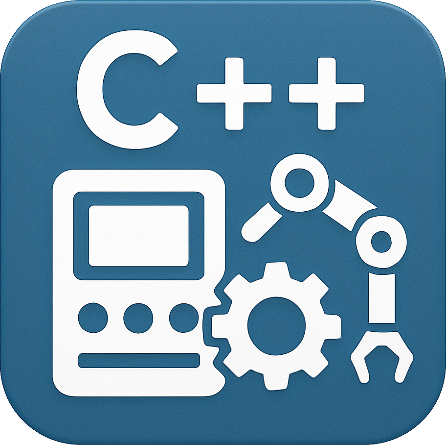

# OCA (Object-oriented Control Architecture)
### Closing the 40-Year Gap in Industrial Automation

## 🚀 Toward the Democratization of Automation Control

**OCA challenges the 40-year stagnation of industrial control.**

For decades, the industry has been held hostage by proprietary hardware and outdated programming paradigms (IEC 61131-3). We believe that **General Purpose OS (Windows/Linux) + Modern C++** can outperform dedicated hardware PLCs when architected correctly.

OCA is not just a "SoftPLC". It is a **deterministic control kernel** built from scratch with **C++20**, designed to prove that software engineering can reclaim the factory floor.

---

## 🏆 Key Performance Metrics

The following performance has been verified on commercial off-the-shelf (COTS) hardware:

| Metric | Performance | Hardware | OS |
| :--- | :--- | :--- | :--- |
| **Cycle Time** | **3.6 µs** (stable) | Siemens SIMATIC IOT2050 | TI AM65x (RT Linux) |
| **Cycle Time** | **10.0 µs** (stable) | Raspberry Pi Zero 2 W | Yocto Linux |
| **Jitter** | < 1.0 µs | - | - |
| **Runtime Allocation** | **0 bytes** | All Platforms | No GC, No `new`/`malloc` |

> *"99% of 'PC-based control' projects fail due to Garbage Collection pauses. OCA solves this by enforcing a strict Zero-Allocation architecture during the runtime cycle."*

---

## 💎 Core Architecture

### 1. Determinism by Design (Zero-Allocation)
Unlike Python or Node.js implementations, OCA prohibits dynamic memory allocation during the control cycle. All memory resources (Tags, Instances, Buffers) are pre-calculated and allocated during the **Start-up Phase**.
- **Result:** No GC pauses, predictable execution time, and rigorous safety.

### 2. True Object-Oriented Logic
Breaking away from the "Copy & Paste" culture of Function Blocks (FB).
- **Inheritance & Polymorphism:** Create a base class `Conveyor` and derive `ConveyorWithSensor`. Modify the base, and all 100 instances update instantly.
- **Vendor Compatibility:** Includes wrapper libraries for **Siemens (P_TRIG, TON)** and **Mitsubishi (PLS, SET)** to bridge the gap for traditional OT engineers.

### 3. Modern DevOps Ecosystem
- **VS Code Integration:** Full-featured extension for Windows.
- **Cross-Compilation:** Docker-based build pipeline hidden behind a single "Build" button.
- **One-Click Deploy:** Automated SCP transfer, permission setting, and service restart via SSH.

---

## 🛠️ Supported Platforms

**Development Environment:**
- Windows 10/11 (Visual Studio Code)

**Runtime Targets:**
- **x64 Windows:** For development and simulation.
- **x64 Linux:** Ubuntu / Debian / RedHat.
- **ARM64 / ARMv7:** Siemens IOT2050, Raspberry Pi 3/4/5/Zero2W (via Yocto/Debian).

---

## 📦 Getting Started

---

## 💡 Tips for Creating User Logic

The actual control processing is executed within `OnExecute()`.

### 1. NetworkBase-derived class instances are persistent

The implementation classes of user logic are instantiated at startup, and their `OnExecute()` methods are called repeatedly. Unlike typical event-driven programming, understand that control logic is characterized by being called repeatedly at high frequency.

### 2. Avoid using `new`, `malloc`, and other memory allocation

Use buffer areas created in the constructor via member variables within `OnExecute()`, or use tags configured as Internal tags to reduce memory allocation overhead. When securing buffers with Internal tag settings, you can use BYTE array declarations (e.g., `BYTE[10]`; other types like Word cannot be used in array declarations).

### 3. Avoid executing high-overhead processing in `OnExecute()`

One scan consists of all `OnExecute()` methods implemented in user logic being called. Even for controls where real-time performance is not critical (such as conveyors), typical hardware controllers have scan cycle times in the range of several milliseconds. Systems with several thousand steps of ladder logic may consider it a control error if the total exceeds 150ms. Always strive to minimize processing time in your `OnExecute()` implementation.

---

## ⚠️ License & Proprietary Notice

**Copyright (c) 2016-2026 Satoshi Murakami. All Rights Reserved.**

This source code and related documentation are the **proprietary property** of Satoshi Murakami.
Unauthorized copying, distribution, modification, or use of this file, via any medium, is strictly prohibited.

* **Non-Commercial Use:** Free for personal evaluation and educational purposes.
* **Commercial Use:** Requires a commercial license.
* **Asset Acquisition:** For inquiries regarding technology transfer or IP acquisition, please contact the author directly.

**Strictly Confidential.**
